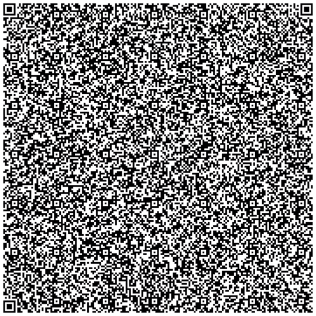
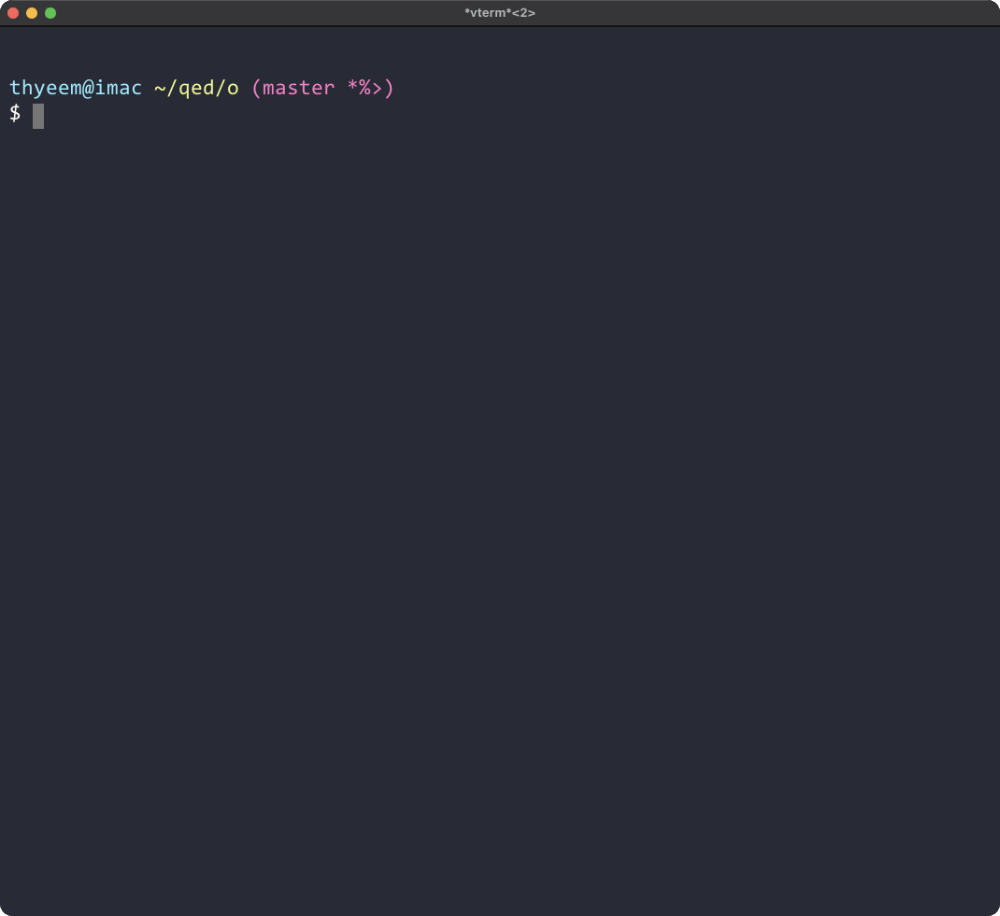

# qed



_Quod Erat Demonstrandum_. _Q.E.D._

__Encode data of any size into a tarball of QR code images.__

Seriously? Yes, we are. `'-']b`

As you know, this is deadly inefficient in terms of _storage_ and _encoding/decoding time_. Due to this inefficiency, it would not be great for simple backup purpose. However, we believe it may have useful uses.

## Quick Start
If not provided `-o filepath` option, __output to `stdout` is the default__.

- encoding output: a `tarball` of QR images &ensp;⟹&ensp; `stdout`

- decoding output: contents of `filepath` &ensp;⟹&ensp; `stdout`

    > If there are multiple files in the original file path (e.g., directory), output `stdout` will be sorted by file hash.
    >
    > If the -o option is provided, the files are extracted to the specified output directory.

#### Encoding
```bash
# encode FILE via stdin
$ cat FILE | qed

# encode FILE via argument
$ qed FILE

# get encoded QR images in the current dir
$ qed FILE | tar xv

# get encoded QR images in the specified DIR
$ qed FILE | tar xv -C DIR

# get encoded QR images as a tarball, "encoded.tar"
$ qed FILE > encoded.tar

# the same as above
$ qed FILE -o encoded.tar

# create a video (as a QR code slideshow) when encoding is finished
$ qed -p FILE

# create a HTML of QR code images on browser when encoding is finished
$ qed -q
```

#### Decoding
```bash
# decode via stdin (a tarball of QR images)
$ cat qr_images.tar | qed -d

# decode via argument of a tarball
$ qed -d qr_images.tar

# decode via argument of a directory of QR code images
$ qed -d qr_images/

# decode via argument of a single file of QR code
$ qed -d qr_image.png

# decode via argument of a video (any files encoded via `qed -p`)
$ qed -d qr_video.mp4

# get decoded original files into the specified file path, "decoded"
$ qed -d encoded.tar > decoded

# the same as above
$ qed -d -o decoded encoded.tar

# -v increases verbosity. see the details how the work is progressing.
$ qed -v FILE | qed -dv
```
For more detailed options, refer to the `Usage` section below.

## Demo



## Features
`qed` is heavily inspired by https://github.com/alisinabh/paperify. We have simpified to improve usability and added some features.

- Fully support for setting [version](https://en.wikipedia.org/wiki/QR_code#Storage) and [error correction level](https://en.wikipedia.org/wiki/QR_code#Error_correction) of the QR code (used `byte-mode` only)

- Uses `stdout` by default as encoder/decoder output.

- Creates some bytes of header when encoding, and provides some information when decoding.

- _deterministically decodes even when ambiguous or conflicting_
  > __No matter of data duplication, filename corruption, file unsorting or filepath relocation__.
  > (assumed that every header of files is not damaged)

In short, once encoded any data by `qed`, it __can be restored by `qed` at any moment__.


## Install
```bash
# prerequisites
# ffmpeg is optional as only used with '-p' option.
$ brew install zbar qrencode imagemagick ffmpeg

# clone
$ git clone https://github.com/thyeem/qed.git
$ cd qed

# put the 'qed' file in $PATH direcoty like $HOME/.local/bin/ if needed
$ chmod +x qed && cp $_ $HOME/.local/bin

# check it out if you want to know it works well. This may take a while.
$ sh test.sh
```

## Usage
```qed
$ qed -h
 qed - encode data of any size into tarballs of QR Code

 Usage: qed [-hdpqzv] [-o output] [-V version] [-l error-correction-level]
            [-s cell-size] [-m margin] [-1 qr-fg-color] [-0 qr-bg-color] filepath

      -h    print this message
      -d    decode input
      -p    create QR Code slideshows (mp4) after encoding is finished
      -q    create QR Code quick-view (HTML document) after encoding is finished
      -v    show in detail how the work is progressing
      -o    set output filepath              (default: '-' for stdout)
      -s    set cell size of QR Code         (default: $QR_CELL_SIZE)
      -m    set margin of QR Code            (recommended 4+,   default: $QR_MARGIN)
      -V    set version of QR Code           (1 to 40,          default: $QR_VERSION)
      -l    set error correction level       (one of [L,M,Q,H], default: $QR_ERROR_CORRECTION)
      -1    set foreground color of QR Code  (6-hexadecimal,    default: $QR_FOREGROUND)
      -0    set background color of QR Code  (6-hexadecimal,    default: $QR_BACKGROUND)
```


## More Examples

In fact, there is no clear reason to use `qed`.

`qed` would say something only when the intermediate result during the process must be `QR codes`.

```bash
# compress the QR code tarball after encoding
$ cat FILE | qed | gzip -c > outfile.tar.gz

# uncompress the tar.gz archive then decode. go back to FILE again (stdout)
$ gunzip -c outfile.tar.gz | qed -d

# create and play a mp4 video (QR code slideshow) when encoding is finished
$ qed -p FILE | xargs open

# create and open QR code images on browser when encoding is finished
$ qed -q FILE | xargs open

# if you want both
$ qed -pq FILE

# identity transform
$ cat FILE | qed | qed -d

# the same
$ qed FILE | qed -d

# the same, but arguments used
$ qed -o outfile.tar FILE | xargs cat | qed -d

# stop COVID-19
$ echo "stop COVID-19" | base64 | qed | qed -d | base64 -d

# backing up directories (who cares?)
$ qed -v FROM_DIR | qed -dv -o TO_DIR

# the method above exactly the same as below. but the above was done via QR encoding/decoding.
$ tar -cvf - FROM_DIR | tar -xv -C TO_DIR

# open the github webpage and save the html file as mp4-QR-slides (who cares?)
# 'browser' pipes stdout to web browser
$ curl -sL https://github.com | qed -pv | qed -dv | browser

# encode/decode with full of options
$ qed -pq -s 16 -m 16 -1 333333 -0 e0ffff -v 30 -l M -o /tmp/tmp FILE | qed -d
```
